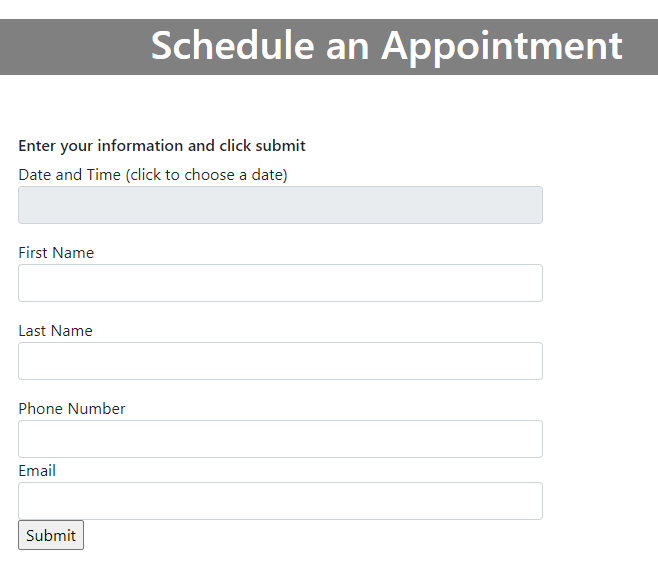

This is a project created for MIS4312 at UH Downtown.  It is a booking webapp that syncrhonizes with google calendar.  

The system runs off of the Flask framework and is hosted on Heroku.com  

The webapp uses the mobiscroll calendar.  To disable dates and timeslots, the calendar uses a webAPI that is sourced from 
a postgresSQL server hosted on Heroku.  

A third party program called Zapier syncs the database to the google calendar.  

User submissions are entered into the SQL database.  From there, Zapier takes the new entry and populates the google calendar.  

Zapier also gathers new, updated, or cancelled data from the google calendar and updates the SQL database. 

From there, Flask presents the new data as API and the mobiscroll calendar disables or enables timeslots. 
