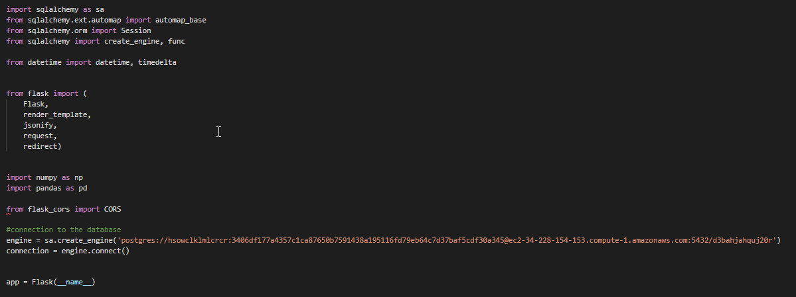
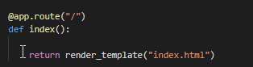
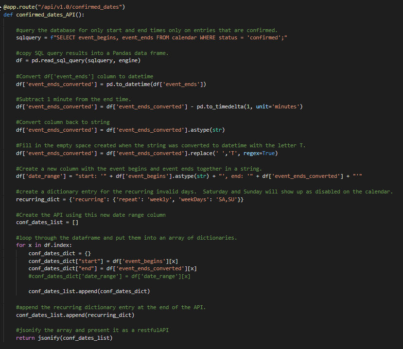

The website run off of the Flask framework.  

SQL queries and webAPIs as well as individual HTML pages are hosted from this framework. 

The date-time picker calls on the confirmed dates API and uses these entries for the invalid dates array.  
These entries will disable the time slots on the date-time picker. 

